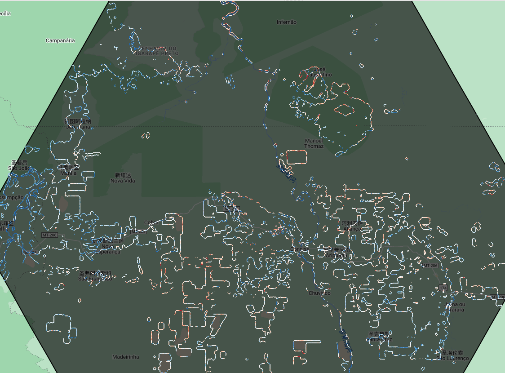

# 思路
1. 由于影响光合作用的因素很多，productivity的边缘效应很难定义，不能够直接去计算

# QC
1. 在一个grid里计算边缘效应即比较forest edge和intact forest时，一个重要假设是：在这个grid中的其他因素比如树种，地形等是相似的
2. 在计算干旱造成的植被异常时遵循的数据筛选条件：
- 在refYears里，地物类型不发生变化，避免地物类型发生变化导致的NIRv改变，因为数据的空间分辨率的要求高，可能会导致计算的anomaly误差
- 地形slope<20°
- Version 1: 
cloudFilterThresh ('CLOUDY_PIXEL_PERCENTAGE') = 60
S2Cld_CloudProbTresh ('S2_CLOUD_PROBABILITY') = 40
CS_CloudProbTresh ('GOOGLE/CLOUD_SCORE_PLUS/V1/S2_HARMONIZED) = 0.64

# TMF dataset
1. Legend
Transition:
  10: Undisturbed tropical moist forest; 20: Degraded tropical moist forest;
  30: Tropical moist forest regrowth; 41: Deforested Land - Forest converted to tree plantations;
  42: Deforested Land - Forest converted to water; Deforested Land - Forest converted to other land cover;
  50: Ongoing deforestation or degradation (2021-2023); 60: Permanent and seasonal water;
  70: Other land cover (including afforestation);
AnnualChanges:
  1: Undisturbed tropical moist forest; 2: Degraded tropical moist forest;
  3: Deforested land; 4: Forest regrowth;
  5: Permanent and seasonal water; 6: Other land cover;
2. GEE上下载的Amazon landcover数据是3000m分辨率的Undisturbed Forest的Cover

# Amazonia Biomass data
1. https://amazonia.mapbiomas.org/en/download/
2. Example code: https://code.earthengine.google.com/?accept_repo=users%2Fmapbiomas%2Fuser-toolkit&scriptPath=users%2Fmapbiomas%2Fuser-toolkit%3Amapbiomas-user-toolkit-lulc.js

# Grid
1. 在QGIS中根据JRC-TMFGirds生成高度为1.5°的hexagon grid
2. 删除Undist_forests Cover<20%的Grids(与10%相差不大)

# GEE
## Forest edge
1. Edge Distance设置:
60-300: 60m*5, 300-900: 120m*5, 900-1800: 180m*5, 1800-3000: 240m*5, 3000-4500: 300m*5, 4500-6300: 360m*5, 
2. 使用更见intense的dists效果不好，因此使用更加sparse的dists 
3. [0,30m]的edge由于分辨率的原因不显示，但是为了防止边缘误差应该是可以去除掉的；作了一个60m的buffer
4. 有一些grid的anomaly是随着dist不断的上升或者下降，这样计算的scale肯定是大于DIST_MAX

## Edge age
1. Edge的初始年为edge的出现年且前两年没有出现egde
2. Edge的宽度设置为[60m, 300m]

## Feature
1. GEE输出Feature属性：{dist:
EVI_count, EVI_max, EVI_mean, EVI_median, EVI_skew, EVI_stdDev, EVI_sum,
NDWI_count, NDWI_max, NDWI_mean, NDWI_median, NDWI_skew, NDWI_stdDev, NDWI_sum,
NIRv_count, NIRv_max, NIRv_mean, NIRv_median, NIRv_skew, NIRv_stdDev, NIRv_sum,
}
2. 在统计的时候还是保留所有的值，不删除末端值

# Analysis
## Importance
1. 在分析时将NIRv scale超过6km的数据去掉

# CMIP6 
1. 单位转化有问题，所以就直接回归校正，不转化单位了
2. 以1985-2014年作为hist baseline

# SPEI
Command line:
process_climate_indices --index spei --periodicity monthly --netcdf_precip F:/Research/AMFEdge/Meteo/Processed/Amazon_CHIRPS_GLEAM_1981_2024_monthlyPetP.nc --var_name_precip precipitation --netcdf_pet F:/Research/AMFEdge/Meteo/Processed/Amazon_CHIRPS_GLEAM_1981_2024_monthlyPetP.nc --var_name_pet Ep --output_file_base F:/Research/AMFEdge/Meteo/Processed/Amazon_CHIRPS_GLEAM_1985_2024_monthlySPEI --scales 1 3 --calibration_start_year 1985 --calibration_end_year 2019 --multiprocessing all

process_climate_indices --index pet --periodicity monthly --netcdf_temp F:/Research/AMFEdge/Meteo/Processed/Amazon_ERA5_1985_2024_monthlyTP.nc --var_name_temp temperature_2m --output_file_base F:/Research/AMFEdge/Meteo/Processed/Amazon_ERA5_1985_2024_monthlyPET --multiprocessing all_but_one
